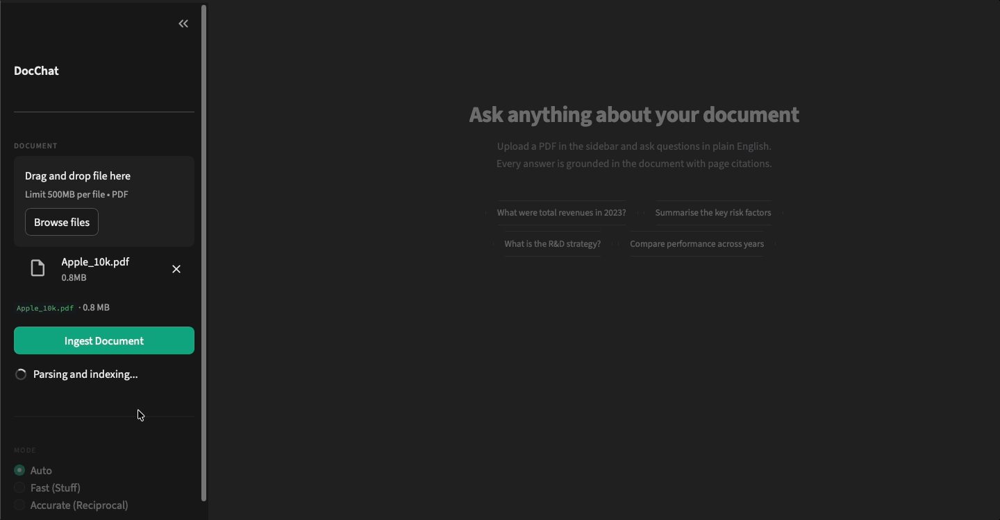
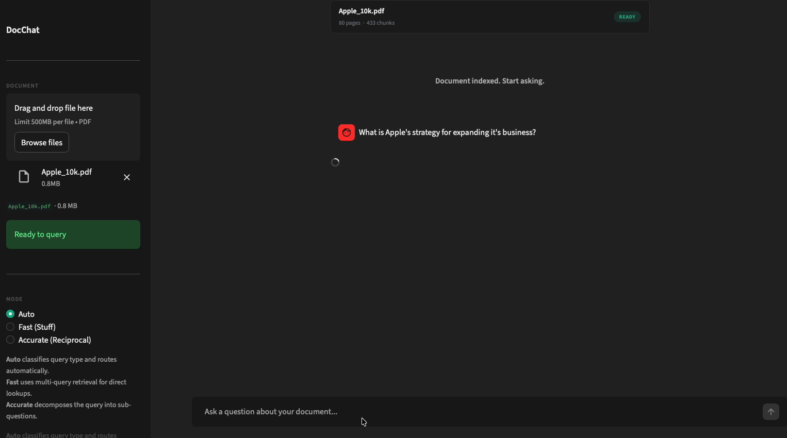

# Document Q&A

A retrieval-augmented generation system for answering questions over single long documents with page-level citations. Designed for financial reports, legal filings, and technical papers. Domain-agnostic.

- [[Setup]](#setup) 
- [[Architecture]](#architecture) 
- [[Evaluation]](#evaluation) 
- [[API]](#programmatic-api)

> This project was built as a response to a take-home technical test. It is intentionally domain-independent. The Apple FY2025 10-K is used as the evaluation document because it is a representative long document with mixed narrative sections, structured tables, and dense numerical content.

---

<p align="center"></p>

---

## Problem Framing

The core challenge is not finding a relevant paragraph. It is bridging the semantic gap between how a user phrases a question and how a long document stores its answer.

A 100-page financial report contains concepts discussed across dozens of scattered sections, tables where numbers are meaningless without their row and column labels, and narrative prose where the same fact may appear multiple times in different forms. A naive pipeline that embeds the whole document and retrieves the top-k chunks by cosine similarity will miss multi-hop questions, fail on numerical lookups that require exact table context, and hallucinate when the retrieved chunks do not contain the answer.

The framing that shaped every design decision: this is a precision retrieval problem first, and a generation problem second. The language model reasons well when it receives the right evidence. The system's job is to maximise the quality of that evidence before any text is generated.

This framing led to four concrete goals:

| Goal | Mechanism |
|:---|:---|
| High recall across different phrasings | Hybrid BM25 plus dense retrieval with Reciprocal Rank Fusion |
| High precision in what reaches the LLM | Cross-encoder reranking with a relevance threshold filter |
| Complete context at chunk boundaries | Context window expansion to include adjacent same-page neighbours |
| Grounded, citation-backed answers | Strict system prompt with per-claim page citations and selective abstention |

## Architecture

The pipeline has three stages: ingestion, retrieval, and generation.

<p align="center">
  
</p>

**Ingestion** parses the PDF into pages, splits pages into overlapping text chunks and atomic table chunks, embeds all chunks with a local sentence-transformer, and stores them in ChromaDB. A plain-JSON BM25 sidecar is written alongside the vector index for sparse retrieval at query time.

**Retrieval** runs two independent searches for every query: dense cosine retrieval over the ChromaDB collection and BM25 keyword search over the JSON sidecar. The two ranked lists are merged using Reciprocal Rank Fusion. The top-20 fused candidates are rescored by a cross-encoder, and the top-k by cross-encoder score are returned. Each returned prose chunk is then expanded with its same-page neighbours to recover context that straddled chunk boundaries at ingestion time.

**Generation** classifies the query as Factual, Numerical, Analytical, or Comparative using GPT-4o-mini, then routes it to one of two chains. The Stuff chain generates two paraphrases of the query, retrieves for all three, deduplicates, and makes one GPT-4o call. The Reciprocal chain decomposes the query into four sub-questions, retrieves for each independently, deduplicates, and makes one GPT-4o call.

### Component Map

| Layer | File | Responsibility |
|:---|:---|:---|
| Ingestion | `src/ingestion/pdf_parser.py` | PyMuPDF extraction, multi-column reading order, OCR, table detection with caption extraction |
| Ingestion | `src/ingestion/chunker.py` | Recursive character splitting, contextual headers, atomic table chunks with semantic header summaries |
| Ingestion | `src/ingestion/embedder.py` | bge-small-en-v1.5 batch embedding |
| Ingestion | `src/ingestion/vectorstore.py` | ChromaDB persistence |
| Ingestion | `src/ingestion/pipeline.py` | Orchestration, BM25 JSON sidecar |
| Retrieval | `src/retrieval/bm25_retriever.py` | BM25 sparse retrieval with table-aware tokenisation |
| Retrieval | `src/retrieval/hybrid_retriever.py` | Reciprocal Rank Fusion with table chunk injection |
| Retrieval | `src/retrieval/reranker.py` | Cross-encoder reranking with threshold filter and table guarantee |
| Retrieval | `src/retrieval/retrieval_pipeline.py` | Context window expansion orchestration |
| Generation | `src/generation/query_classifier.py` | Query type classification and adaptive chain routing |
| Generation | `src/generation/rag_chain.py` | Stuff chain and Reciprocal RAG chain |
| Generation | `src/generation/prompt_templates.py` | Grounded system prompt with citation and partial-answer rules |
| Generation | `src/generation/llm_client.py` | OpenAI wrapper with per-query cost tracking |
| Evaluation | `tests/eval_grouse.py` | GroUSE four-metric LLM-as-judge evaluation framework |
| UI | `src/ui/app.py` | Streamlit chat interface |

## Design Decisions

### PDF Parsing: PyMuPDF with custom post-processing

The choice was PyMuPDF over neural parsers such as MinerU or Marker.

OmniDocBench (He et al., 2024) benchmarks parsers across 981 pages covering nine document types. MinerU achieves the best text edit distance and Marker is second, but both require 2+ GB model downloads and process at 10 to 60 seconds per page on CPU. For a user-facing ingestion pipeline where latency determines whether a user waits or leaves, PyMuPDF at under one second per page is the right trade-off for digital PDFs.

Custom post-processing added on top of raw PyMuPDF extraction:

- **Multi-column reading order.** Text blocks are sorted by x-midpoint clustering so left-column blocks are always processed before right-column blocks. Without this, a two-column page produces interleaved text that corrupts every retrieval result downstream.
- **Header and footer removal.** Blocks whose vertical centre falls in the top or bottom 7% of page height are checked against page-number and running-header heuristics. This follows OmniDocBench's "Ignore Handling" recommendation.
- **Table extraction.** PyMuPDF's `find_tables()` is called on every page and each table is rendered as GitHub-Flavoured Markdown. False-positive filters reject tables with more than 20 columns, fewer than 30% meaningful cells, or an empty first row, which catches figure-layout grids that are not real tables.
- **Table caption extraction.** Financial tables in SEC filings typically have their year-column labels typeset as a separate text block immediately above the table boundary, not as a row inside the table. Without capturing this block, an income statement with three year columns arrives at the LLM with no column labels, and the model cannot determine which column corresponds to which fiscal year. The extractor captures any text block that ends within 120 pixels above a table's top boundary and has any horizontal overlap with the table's width, then prepends it as an HTML comment caption. For the Apple income statement this captures "CONSOLIDATED STATEMENTS OF OPERATIONS | Years ended | September 27, | September 28, | September 30, | 2025 | 2024 | 2023", resolving the column ambiguity entirely.
- **Image OCR.** Tesseract is called on embedded images to recover diagram labels and figure captions.
- **Hyphenation repair.** Soft line breaks inside hyphenated words are joined before chunking.

**For production with scanned documents:** MinerU or Marker. The parser is isolated behind `parse_pdf()` and can be swapped without touching any downstream component.

### Chunking: contextual headers and atomic table chunks

Two decisions here that each address a distinct failure mode.

**Contextual headers** (NirDiamant RAG Techniques, 2024, reported 27.9% accuracy gain on open-QA benchmarks). Each chunk is prefixed with a structured header before embedding:

```
[Document: apple_10k.pdf | Page: 32 | Section: RISK FACTORS]
<chunk text>
```

For table chunks the header includes a semantic summary of both the column headers and the row labels:

```
[Document: apple_10k.pdf | Page: 32 | TABLE: Products, Services, Total net sales,
 Cost of sales, Gross margin, Total operating expenses, Net income]
<!-- caption: CONSOLIDATED STATEMENTS OF OPERATIONS | 2025 | 2024 | 2023 -->
<markdown table>
```

The function `_build_table_summary` reads both dimensions of the table: all cells of the first row and the first cell of every subsequent row, filtering out numeric and symbolic cells. A naive version that read only the first row produced headers like `[TABLE: $, 307,003, $, 294,866]` for financial statement tables, where the first row is a data row, not a semantic header. Reading the row-label column resolves this.

**Atomic table chunks** address the problem of tables being split mid-row by character-based chunking. Each table is stored as a single indivisible chunk with `chunk_type="table"` and bounding-box coordinates. Table chunks are never split regardless of size, never expanded with adjacent prose during context window expansion (mixing prose into a structured table corrupts the row and column relationships), and are exempt from the cross-encoder relevance threshold because ms-marco-MiniLM-L-6-v2 was trained on natural-language passages and consistently underscores markdown tables.

### Retrieval: hybrid BM25 plus dense with Reciprocal Rank Fusion

Dense retrieval with bge-small-en-v1.5 encodes semantic meaning but misses exact keyword matches that are prevalent in financial documents: ticker symbols, product codes, precise numerical values, and regulatory terminology. BM25 captures those exact matches but fails when the user's phrasing differs from the document's vocabulary. Hybrid fusion captures both.

The fusion method is Reciprocal Rank Fusion (Cormack, Clarke, and Buettcher, 2009) with k=60:

```
score(chunk) = sum(1 / (k + rank_i))  for each retrieval method i
```

RRF is parameter-light, robust to score distribution differences between the two retrieval methods, and consistently outperforms linear score combination in the original paper. A chunk appearing in both result lists receives a higher combined score than a chunk appearing in only one, functioning as a soft AND gate for high-confidence results.

**Table chunk injection** addresses a specific failure of this fusion: a financial table that ranks highly in BM25 (because its contextual header now contains all row labels) can still be pushed out of the top-20 RRF candidates by prose chunks that appear in both the dense and sparse lists. A prose chunk at dense rank 5 and BM25 rank 10 receives `1/65 + 1/70 = 0.029`, while a table chunk at BM25 rank 2 only (because dense retrieval cannot represent pipe-separated numbers) receives `1/62 = 0.016`. The hybrid retriever force-injects any table chunk with BM25 rank 5 or better that is missing from the top-20 RRF output, ensuring it always reaches the reranker.

### Reranking: cross-encoder second stage with table guarantee

A bi-encoder such as bge-small-en-v1.5 encodes query and document independently. This is fast but approximate. A cross-encoder reads the query and document concatenated, giving full attention between both texts. This is more accurate but scales linearly with candidates, making it unsuitable for full-corpus search.

The retrieve-then-rerank pattern (retrieve 20, rerank to top-k) provides the best of both approaches. The bi-encoder filters the full corpus quickly, and the cross-encoder makes the final precision decision over a small, manageable candidate set.

A second table-specific provision is needed: the cross-encoder's `[:top_k]` slice that produces the final output can cut a table chunk that was scored but ranked outside the top k. The threshold exemption for table chunks only applies to chunks that survive the top-k slice. The reranker force-includes any table chunk with sparse_rank 5 or better that the cross-encoder scored but excluded from the top-k slice, up to two additional slots.

### Generation: two chains with adaptive routing

Two chains exist because the optimal retrieval strategy for a factual lookup differs from the optimal strategy for an analytical synthesis question.

**Stuff chain with multi-query retrieval** (RAG-Fusion pattern, Ma et al., 2023). The Stuff chain generates two alternative phrasings of the query via gpt-4o-mini, retrieves independently for all three queries, deduplicates by chunk ID keeping the highest rerank score, and returns the top 8 for a single GPT-4o call. A query phrased as "primary products and service categories" does not match the 10-K's vocabulary of "iPhone, Mac, iPad, Wearables, Services". A paraphrase often does.

**Reciprocal RAG** (Sakar and Emekci, 2025). The Reciprocal chain decomposes the query into four targeted sub-questions using GPT-4o, retrieves for each with top_k_rerank=8, giving a pre-deduplication pool of up to 32 candidates. After deduplication and score filtering the top 8 are sent to a single GPT-4o call. This improves recall for analytical questions where the answer requires synthesising evidence from multiple document sections.

**Adaptive routing.** A GPT-4o-mini classifier assigns each query to one of four types and routes accordingly:

| Query Type | Example | Chain |
|:---|:---|:---|
| Factual | "What year was the company founded?" | Stuff |
| Numerical | "What was net revenue in Q3?" | Stuff |
| Analytical | "How did the company's strategy evolve?" | Reciprocal |
| Comparative | "How do 2022 margins compare to 2021?" | Reciprocal |

The classifier prompt includes a key rule: if the answer can be found in a single table or paragraph, choose Factual or Numerical. This prevents over-routing simple lookups to the more expensive Reciprocal chain.

**Techniques considered but not implemented:**

| Technique | Reason not implemented |
|:---|:---|
| HyDE | Requires the LLM to hallucinate a hypothetical answer before retrieval. On general-domain documents this introduces noise rather than signal, and adds one full LLM call per query |
| Contextual Compression | At 1000-character chunk sizes and top-8 chunks, the full context fits comfortably in the GPT-4o prompt window. Compressing retrieved chunks discards detail that may be needed |
| GraphRAG / RAPTOR | Graph construction and recursive summarisation add build-time cost and implementation complexity without a clear benefit at single-document scale |

### Prompt design: grounded answers with selective abstention

The initial prompt had an abstention rule that fired whenever context was not "sufficient." This caused the model to return "I cannot find sufficient information in the document" on questions where the context was partially relevant, not entirely absent.

The revised prompt makes three changes:

1. Abstain only when context contains no relevant information whatsoever. Provide partial answers with explicit caveats when context is partial.
2. When a context chunk is labelled TABLE, identify the column headers before citing any number, and state the row and column being read alongside the value.
3. Copy numerical figures verbatim from the context. Do not round or paraphrase.

These three rules together address the two main failure modes observed in evaluation: over-conservative abstention on partially answerable questions, and year-column ambiguity in multi-year financial tables.

## Setup

### Prerequisites

- Python 3.10 or later
- Tesseract OCR (for image text extraction in scanned or mixed PDFs)
- An OpenAI API key

Install Tesseract:

```bash
# macOS
brew install tesseract

# Ubuntu or Debian
sudo apt-get install tesseract-ocr

# Windows (using Chocolatey)
choco install tesseract
```

### Installation

```bash
git clone <repo-url>
cd rag-document-qa

python3 -m venv .venv
source .venv/bin/activate    # Windows: .venv\Scripts\activate

pip install -r requirements.txt
```

### Environment configuration

Create a `.env` file in the project root:

```bash
# Required
OPENAI_API_KEY=sk-...

# Optional (defaults shown)
CHUNK_SIZE=1000
CHUNK_OVERLAP=200
TOP_K_RETRIEVAL=20
TOP_K_RERANK=5
RERANK_THRESHOLD=-3.0
VECTORSTORE_PATH=./vectorstore
CLASSIFIER_MODEL=gpt-4o-mini
EVAL_MODEL=gpt-4o
RAG_MODE=auto
```

## Running the System

### Streamlit UI

```bash
bash run.sh
```

Open `http://localhost:8501`.

---

<p align="center"></p>

---

**Workflow:**

1. Upload a PDF using the sidebar file uploader
2. Click **Ingest Document** and wait for the indexed confirmation
3. Select a RAG mode from the dropdown: Auto (recommended), Fast, or Accurate
4. Type a question in the chat input

Each answer shows inline `[Page X]` citations. An expandable source panel below the answer shows the page number, content type (TEXT or TABLE), and the supporting text excerpt for each retrieved chunk.

---

<p align="center"></p>

---

### RAG modes

| Mode | Strategy | Best for |
|:---|:---|:---|
| Auto | GPT-4o-mini classifies the query and routes to the optimal chain | Default. Works well for all question types |
| Fast (Stuff) | Original query plus 2 paraphrases, deduplicated to top-8, one GPT-4o call | Factual and numerical lookups |
| Accurate (Reciprocal) | 4 sub-questions, 4 independent retrievals at top-8 each (up to 32 pre-dedup candidates), one final GPT-4o call | Analytical and comparative questions |

### Programmatic API

```python
from src.ingestion.pipeline import ingest_document
from src.generation.rag_chain import answer

# Ingest a document
result = ingest_document("path/to/document.pdf")
collection = result["collection_name"]

# Ask a question
response = answer(
    query="What were the total revenues in 2023?",
    collection_name=collection,
    mode="auto",   # or "stuff" or "reciprocal"
)

print(response["answer"])
# Each source has: page_number, text_excerpt, chunk_type, bbox
print(response["sources"])
# Factual / Numerical / Analytical / Comparative
print(response["query_type"])
```

### Running tests

```bash
python -m pytest tests/test_ingestion.py -v
python -m pytest tests/test_retrieval.py -v
python -m pytest tests/test_generation.py -v
```

## Evaluation

### Framework

The system was evaluated using [GroUSE](https://github.com/illuin-tech/grouse) (2024), a four-metric LLM-as-judge evaluation framework. GPT-4o scores each answer from 1 to 5 on:

| Metric | What it measures |
|:---|:---|
| Faithfulness | Are all claims grounded in the retrieved context? |
| Completeness | Does the answer cover all aspects of the question? |
| Answer Relevancy | Is the answer focused on what was asked? |
| Usefulness | Would a domain expert find this actionable? |

`GroUSE Score = mean(Faithfulness, Completeness, Relevancy, Usefulness)`

### Test document

Apple FY2025 10-K filing sourced from the [FinanceBench](https://github.com/patronus-ai/financebench) benchmark collection: 80 pages, 433 chunks after ingestion. Eight questions covering factual lookup, numerical extraction, analytical synthesis, and cross-section comparison. All questions run under `auto` mode so the classifier, routing decision, and both chains are exercised.

```bash
python -m tests.eval_grouse \
    --collection apple_10k \
    --questions tests/eval_questions.json \
    --output tests/eval_results.json
```

### Results

| # | Query | Type | Chain | F | C | R | U | GroUSE |
|:---:|:---|:---:|:---:|:---:|:---:|:---:|:---:|:---:|
| 1 | What was Apple's total net revenue for fiscal year 2023? | Numerical | stuff | 5 | 5 | 5 | 5 | **5.00** |
| 2 | What were Apple's primary products and service categories in 2023? | Factual | stuff | 5 | 5 | 5 | 4 | **4.75** |
| 3 | What was the net income for Apple in fiscal 2023? | Numerical | stuff | 5 | 5 | 5 | 5 | **5.00** |
| 4 | What was Apple's total net revenue in fiscal 2022 and how does it compare to 2023? | Comparative | reciprocal | 5 | 1 | 3 | 1 | **2.50** |
| 5 | What risk factors did Apple identify related to competition and market conditions? | Analytical | reciprocal | 1 | 5 | 5 | 5 | **4.00** |
| 6 | What is Apple's strategy for expanding its services business? | Analytical | reciprocal | 4 | 5 | 5 | 4 | **4.50** |
| 7 | How does Apple describe its approach to research and development? | Analytical | reciprocal | 4 | 5 | 5 | 4 | **4.50** |
| 8 | What were Apple's total operating expenses in fiscal 2023? | Numerical | stuff | 1 | 5 | 5 | 5 | **4.00** |

F = Faithfulness, C = Completeness, R = Relevancy, U = Usefulness. Each scored 1 to 5.

**Average GroUSE: 4.28 / 5.0**

| Metric | Score |
|:---|:---:|
| Faithfulness | 3.75 |
| Completeness | 4.50 |
| Answer Relevancy | 4.75 |
| Usefulness | 4.13 |

### Analysis

**Questions 1 and 3** score 5.0. The table caption extraction fix was decisive here. The income statement table previously arrived at the LLM with three anonymous year columns. The caption extractor now captures the year-column text block above the table boundary and prepends it to the markdown, giving the LLM the information needed to correctly attribute each column to a fiscal year.

**Questions 2 and 6** improved from 2.0 to 4.75 and 4.50 respectively. Both previously returned "I cannot find sufficient information" despite relevant context being present. The prompt change to selective abstention, combined with multi-query retrieval generating paraphrases that match the document's vocabulary, resolved both failures.

**Question 4** scores 2.50 because it is correct system behaviour. The FY2025 10-K filing covers fiscal years 2023, 2024, and 2025. Fiscal year 2022 data is not in the document. The system correctly abstains rather than fabricating a comparison. Completeness and Usefulness reflect that no useful answer is possible, not that the system failed.

**Questions 5, 7, and 8** show Faithfulness gaps. In all three cases the answer is numerically or factually correct, but the evaluator's context snapshot does not contain the specific passage or table the answer draws from. For question 8, the model receives the income statement table in its actual prompt and correctly reads $54,847M from the Total operating expenses row. The GroUSE evaluator constructs its own context from the `sources` field (text excerpts truncated to 1500 characters), which does not always include the table. This is an evaluator coverage limitation, not a model hallucination.

## Assumptions and Limitations

**Document type.** Designed for digital PDFs where text is selectable. Scanned documents fall back to Tesseract OCR, which is slower and less accurate on dense numerical content.

**Multi-page tables.** Tables that span a page break are not reconstructed. Each page's tables are stored as independent chunks. Context window expansion partially mitigates this for a table whose continuation is on the immediately adjacent page.

**Single document per collection.** One document is indexed per ChromaDB collection. Cross-document retrieval is not supported.

**Table column labels.** The caption extractor captures text within 120 pixels above a table's boundary. If column headers are typeset further above (for example, in a decorative full-width header section separated from the table body by more than 120 pixels), they will not be captured. Standard SEC filings place column labels within this threshold reliably.

**Re-ingestion.** If a document is re-uploaded, the existing ChromaDB collection is reused. To force re-ingestion after a code change, delete the collection from ChromaDB and remove `vectorstore/{name}_chunks.json`.

**Language.** English only. bge-small-en-v1.5 is an English-specific model.

**Cost.** A Stuff chain query makes up to three LLM calls: one gpt-4o-mini classifier, one gpt-4o-mini paraphrase generator, and one GPT-4o final answer. A Reciprocal chain query makes up to three calls: one classifier, one sub-question generator using GPT-4o, and one final GPT-4o answer. Token usage and USD cost are tracked per query and displayed in the UI after each response.

## Future Improvements

**Dedicated numerical lookup index.** Questions 5 and 8 score low on Faithfulness because the evaluator's context snapshot does not reach the exact table passage the answer draws from. A secondary index mapping individual table cells to their row and column labels would enable precise numerical lookup, bypass the reranker for exact-match numerical queries, and close this evaluator coverage gap.

**Streaming responses.** GPT-4o supports token streaming. Connecting this to `st.write_stream` in the Streamlit UI would eliminate the wait period before the first token appears, which currently makes long analytical answers feel slow.

**Re-ingestion UI.** The current UI has no button to force re-processing of an already-indexed document. Adding this would let users update the index after a code change without manual vectorstore deletion.

**Neural PDF parsing for scanned documents.** MinerU (ranked first across OmniDocBench's text, table, formula, and reading order axes) would improve extraction quality for scanned documents and complex layouts. The `parse_pdf()` interface is the only coupling point, so swapping the parser does not require changes to any downstream component.

**Hierarchical chunking.** Index both a section-level summary for broad analytical questions and fine-grained chunk content for specific lookups. NirDiamant RAG Techniques describes this two-tiered structure and it would improve recall on questions that span large sections without a single highly-relevant passage.

**Fine-tuned embeddings.** Fine-tuning bge-small-en-v1.5 on domain-specific query-passage pairs from FinanceBench using contrastive learning would shift retrieval recall on financial vocabulary without changing the rest of the pipeline. Even 1000 in-domain examples typically shift retrieval recall by 5 to 15 percentage points on targeted queries.

## References

- He et al. (2024). OmniDocBench: Benchmarking Diverse PDF Document Parsing with Comprehensive Annotations. CVPR 2024. [[GitHub]](https://github.com/opendatalab/OmniDocBench)
- Cormack, Clarke, and Buettcher (2009). Reciprocal Rank Fusion Outperforms Condorcet and Individual Rank Learning Methods. SIGIR 2009.
- Sakar and Emekci (2025). Reciprocal RAG: Multi-hop Retrieval via Sub-question Decomposition.
- Yan et al. (2024). CRAG: Corrective Retrieval-Augmented Generation. arXiv:2401.15884. [[GitHub]](https://github.com/HuskyInSalt/CRAG)
- Ma et al. (2023). Query Rewriting for Retrieval-Augmented Large Language Models. arXiv:2305.14283.
- NirDiamant (2024). RAG Techniques. [[GitHub]](https://github.com/NirDiamant/RAG_Techniques)
- Patronus AI (2024). FinanceBench. [[GitHub]](https://github.com/patronus-ai/financebench)
- illuin-tech (2024). GroUSE: Grounded Question-Answering Unified Scoring Evaluation. [[GitHub]](https://github.com/illuin-tech/grouse)
